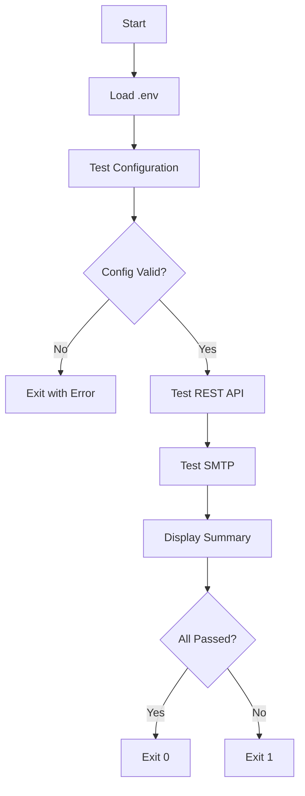

# Project Structure

Understanding the useSend Testing Suite codebase.

## Directory Structure

```
usesend-test/
├── .env                    # Environment variables (gitignored)
├── .env.example           # Example environment file
├── .gitignore             # Git ignore rules
├── LICENSE                # MIT License
├── README.md              # Project README
├── package.json           # Node.js dependencies and scripts
├── package-lock.json      # Locked dependency versions
├── test-usesend.js        # Main test script
├── next.config.mjs        # Nextra configuration
├── theme.config.jsx       # Documentation theme config
├── node_modules/          # Installed dependencies (gitignored)
└── pages/                 # Documentation pages
    ├── _meta.js           # Navigation structure
    ├── index.mdx          # Home page
    ├── getting-started.mdx
    ├── configuration.mdx
    ├── running-tests.mdx
    ├── api-examples.mdx
    ├── aws-ses-sandbox.mdx
    ├── troubleshooting.mdx
    └── project-structure.mdx
```

## Key Files

### Configuration Files

#### `.env`

Environment variables for configuration. **Never commit this file!**

```env
USESEND_API_KEY=your_api_key
USESEND_BASE_URL=https://your-instance.com
SENDER_EMAIL=noreply@yourdomain.com
RECIPIENT_EMAIL=your@email.com
SMTP_HOST=your-instance.com
SMTP_PORT=465
SMTP_USERNAME=usesend
SMTP_PASSWORD=your_api_key
```

#### `.env.example`

Template for `.env` file. Safe to commit to git.

#### `.gitignore`

Prevents sensitive files from being committed:

```
.env
node_modules/
.next/
out/
```

### Application Files

#### `test-usesend.js`

The main test script containing:

1. **Configuration Loading** (lines 1-17)
   - Imports dependencies
   - Loads environment variables
   - Creates config object

2. **Utility Functions** (lines 19-47)
   - Console logging with colors
   - Success/error/info/warning helpers

3. **Test Functions**
   - `testRestAPI()` (lines 50-104) - REST API testing
   - `testSMTP()` (lines 107-162) - SMTP testing
   - `testConfiguration()` (lines 165-192) - Config validation

4. **Main Runner** (lines 195-264)
   - `runAllTests()` - Orchestrates all tests
   - Displays summary and results
   - Exits with appropriate status code

#### `package.json`

Node.js project configuration:

```json
{
  "name": "usesend-test",
  "version": "1.0.0",
  "type": "module",
  "scripts": {
    "test": "node test-usesend.js",
    "docs:dev": "next dev",
    "docs:build": "next build",
    "docs:start": "next start"
  },
  "dependencies": {
    "dotenv": "^16.3.1",
    "nodemailer": "^6.9.7"
  }
}
```

### Documentation Files

#### `next.config.mjs`

Nextra (Next.js) configuration for documentation site:

```javascript
import nextra from 'nextra'

const withNextra = nextra({
  theme: 'nextra-theme-docs',
  themeConfig: './theme.config.jsx',
  defaultShowCopyCode: true
})

export default withNextra({
  output: 'export',
  images: {
    unoptimized: true
  }
})
```

#### `theme.config.jsx`

Theme customization for documentation:

```jsx
export default {
  logo: <span>useSend Testing Suite</span>,
  project: {
    link: 'https://github.com/rcdelacruz/usesend-test'
  },
  docsRepositoryBase: 'https://github.com/rcdelacruz/usesend-test/tree/main',
  footer: {
    content: <span>MIT 2025 © useSend Testing Suite</span>
  }
}
```

## Code Architecture

### Test Flow



### Configuration Flow

```
.env file
    ↓
dotenv.config()
    ↓
process.env variables
    ↓
config object
    ↓
Test functions
```

### Logging System

The script uses color-coded console output:

| Function | Color | Use Case |
|----------|-------|----------|
| `logSuccess()` | Green | Successful operations |
| `logError()` | Red | Errors and failures |
| `logInfo()` | Cyan | Informational messages |
| `logWarning()` | Yellow | Warnings |
| `log()` | Custom | Headers and banners |

Example:
```javascript
logSuccess('Email sent successfully!');  // ✓ Green
logError('Failed to connect');           // ✗ Red
logInfo('Attempting to send...');        // ℹ Cyan
logWarning('Rate limit approaching');    // ⚠ Yellow
```

## Dependencies

### Production Dependencies

#### dotenv (`^16.3.1`)
- **Purpose:** Load environment variables from `.env` file
- **Usage:** `import dotenv from 'dotenv'; dotenv.config();`
- **Why needed:** Securely manage configuration

#### nodemailer (`^6.9.7`)
- **Purpose:** Send emails via SMTP
- **Usage:** `nodemailer.createTransport({...})`
- **Why needed:** SMTP testing functionality

### Development Dependencies

#### next (`^16.0.10`)
- **Purpose:** React framework for documentation
- **Usage:** Powers the documentation site
- **Why needed:** Nextra is built on Next.js

#### nextra (`^4.6.1`)
- **Purpose:** Documentation site generator
- **Usage:** Converts MDX to beautiful docs
- **Why needed:** Creates this documentation

#### nextra-theme-docs (`^4.6.1`)
- **Purpose:** Documentation theme
- **Usage:** Provides UI/UX for docs
- **Why needed:** Styling and components

#### react & react-dom (`^19.2.3`)
- **Purpose:** UI library
- **Usage:** Required by Next.js/Nextra
- **Why needed:** Documentation framework dependency

## Scripts

### `npm test`

Runs the main test suite:
```bash
npm test
# Equivalent to: node test-usesend.js
```

### `npm run docs:dev`

Starts the documentation development server:
```bash
npm run docs:dev
# Open http://localhost:3000
```

### `npm run docs:build`

Builds static documentation:
```bash
npm run docs:build
# Creates static site in ./out/
```

### `npm run docs:start`

Serves built documentation:
```bash
npm run docs:start
# Requires docs:build first
```

## Customization

### Adding New Tests

To add a new test function:

1. **Create test function:**
```javascript
async function testNewFeature() {
  log('\n═══════════════════════════════', colors.blue);
  log('TEST: New Feature', colors.blue);
  log('═══════════════════════════════\n', colors.blue);

  try {
    // Your test logic here
    logSuccess('New feature test passed!');
    return true;
  } catch (error) {
    logError(`New feature test failed: ${error.message}`);
    return false;
  }
}
```

2. **Add to test runner:**
```javascript
// In runAllTests() function
const results = {
  config: configValid,
  restAPI: false,
  smtp: false,
  newFeature: false  // Add this
};

// Run your test
results.newFeature = await testNewFeature();

// Add to summary
const summary = [
  { name: 'Configuration Check', passed: results.config },
  { name: 'REST API Test', passed: results.restAPI },
  { name: 'SMTP Test', passed: results.smtp },
  { name: 'New Feature Test', passed: results.newFeature }  // Add this
];
```

### Modifying Email Templates

Email templates are in the test functions:

**REST API email** (line 56-71 in `testRestAPI()`):
```javascript
const emailData = {
  from: config.sender,
  to: config.recipient,
  subject: `Custom Subject - ${new Date().toISOString()}`,
  html: `<h1>Custom HTML</h1>`,
  text: `Custom text version`
};
```

**SMTP email** (line 132-148 in `testSMTP()`):
```javascript
const mailOptions = {
  from: config.sender,
  to: config.recipient,
  subject: `Custom SMTP Subject`,
  html: `<h1>Custom SMTP HTML</h1>`,
  text: `Custom SMTP text`
};
```

### Adding Configuration Variables

1. **Add to `.env`:**
```env
NEW_CONFIG_VARIABLE=value
```

2. **Add to config object (line 6-16):**
```javascript
const config = {
  apiKey: process.env.USESEND_API_KEY,
  baseUrl: process.env.USESEND_BASE_URL,
  newConfig: process.env.NEW_CONFIG_VARIABLE  // Add this
};
```

3. **Add to validation (line 170-179):**
```javascript
const checks = [
  { name: 'API Key', value: config.apiKey },
  { name: 'New Config', value: config.newConfig }  // Add this
];
```

## Best Practices

### File Organization

- Keep test logic in `test-usesend.js`
- Keep configuration in `.env`
- Keep documentation in `pages/`
- Never commit `.env` or `node_modules/`

### Code Style

- Use `async/await` for asynchronous operations
- Use color-coded logging for clarity
- Handle errors gracefully with try/catch
- Return boolean from test functions (true/false)
- Add clear comments for complex logic

### Testing

- Test each function independently
- Validate configuration before running tests
- Provide clear error messages
- Exit with appropriate status codes (0 = success, 1 = failure)

## Next Steps

- Review [Configuration](/configuration) for environment setup
- See [Running Tests](/running-tests) for execution details
- Check [API Examples](/api-examples) for integration code
